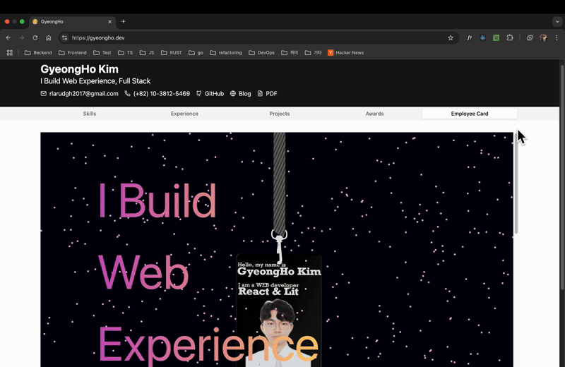
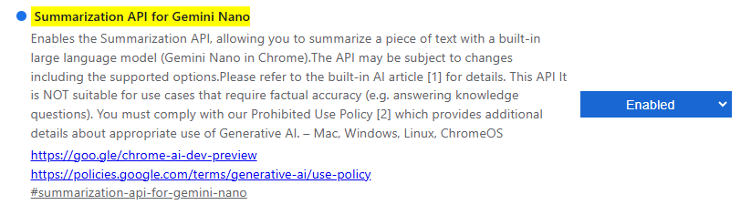
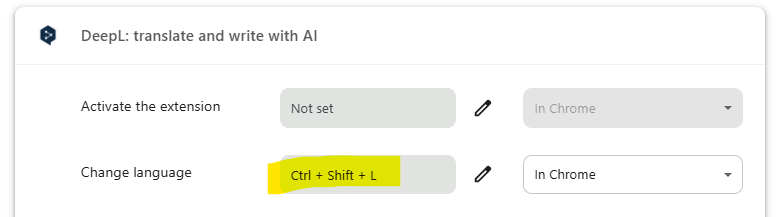

# LazyBookmark

You can install it from [Chrome Web Store](https://chromewebstore.google.com/detail/apapcobjnbpmndcpcedjhngmgocjancj?utm_source=item-share-cb)

A Chrome extension that provides nvim-telescope like interface for searching(live-grep) and previewing bookmarks. Press `Ctrl+Shift+L` (or `Cmd+Shift+L` on Mac) to open the leader palette, then press `g` to search bookmarks.

## Prerequisites

> ⚠️ **Chrome Version Requirement for Gemini LLM Model**:
> This extension requires Chrome version 138 or later for the AI preview features. [Click here to check your chrome version](chrome://version)
>
> ⚠️ **Chrome Flags Configuration**:
> The preview pane uses Chrome's built-in Gemini LLM model for summarizing bookmarked pages. To enable this feature, you must enable the `chrome://flags/#summarization-api-for-gemini-nano` flag in Chrome. [Click here to enable Summarization API for Gemini Nano](chrome://flags/#summarization-api-for-gemini-nano)
>
> 
>
> ⚠️ **Shortcut Conflicts**:
> The `Ctrl+Shift+L` shortcut(or `Cmd+Shift+L` on Mac) might already be assigned to other extensions that you are using. If the leader palette doesn't open when you press `Ctrl+Shift+L`, check for conflicts by visiting `chrome://extensions/shortcuts` in your Chrome browser. You may need to change the shortcut in your extension settings or disable conflicting extensions. [Click here to check your shortcut conflicts](chrome://extensions/shortcuts)
>
> 

## Features

- **Quick Access**: Press `Ctrl+Shift+L` (or `Cmd+Shift+L` on Mac) to open the leader palette, then press `g` to search bookmarks
- **Leader palette**: LazyVim inspired command palette system (Cmd + Shift + L), `a` to quick add current page, `b` to open the bookmark manager, `g` to search bookmarks
- **Quick Bookmark Add**: Press `a` to add current page as bookmark in Leader palette
- **Bookmark Manager**: Press `b` to open the bookmark manager(tree view of bookmarks with add, edit, delete actions)
- **Live Grep**: Search through bookmarks with regex support
- **Preview Pane**: Shows summary of bookmarks, or HTML content of selected bookmarks
- **LazySth UI/UX**: Dark theme with familiar LazySth-like interface, keyboard power user friendly with keyboard-centric navigation
- **AI features**: Preview pane showing bookmark summaries using Chrome Built-in AI

### Basic Features

- [x] Add bookmark keyboard shortcut ([#12](https://github.com/GyeongHoKim/gyeongho-bookmark-telescope/issues/12))
- [x] Editing existing bookmark ([#13](https://github.com/GyeongHoKim/gyeongho-bookmark-telescope/issues/13))
- [x] Telescope(Live Grep) bookmarks

### Core AI Features

- [ ] Semantic Search ([#3](https://github.com/GyeongHoKim/gyeongho-bookmark-telescope/issues/3))
- [x] AI-Powered Summary ([#4](https://github.com/GyeongHoKim/gyeongho-bookmark-telescope/issues/4))
- [ ] Auto-Categorization ([#5](https://github.com/GyeongHoKim/gyeongho-bookmark-telescope/issues/5))

### Advanced Features

- [ ] Visual Bookmark Creation ([#6](https://github.com/GyeongHoKim/gyeongho-bookmark-telescope/issues/6))
- [ ] Voice Management ([#7](https://github.com/GyeongHoKim/gyeongho-bookmark-telescope/issues/7))
- [ ] Multilingual Support ([#8](https://github.com/GyeongHoKim/gyeongho-bookmark-telescope/issues/8))
- [ ] Writing Assistant ([#9](https://github.com/GyeongHoKim/gyeongho-bookmark-telescope/issues/9))
- [ ] Hybrid AI Sync ([#10](https://github.com/GyeongHoKim/gyeongho-bookmark-telescope/issues/10))
- [ ] Analytics Dashboard ([#11](https://github.com/GyeongHoKim/gyeongho-bookmark-telescope/issues/11))

## Installation

1. Open Chrome and navigate to `chrome://extensions/`
2. Enable "Developer mode" in the top right
3. Click "Load unpacked" and select this directory
4. The extension will be installed and ready to use

## Usage

1. **Open Telescope**: Press `Ctrl+Shift+L` (Windows/Linux) or `Cmd+Shift+L` (Mac) to open leader palette, then press `g`
2. **Search**: Type in the search box to filter bookmarks by title or URL
3. **Navigate**: Use ↑↓ arrow keys to navigate through results
4. **Preview**: Selected bookmark's page content will be shown in the preview pane
5. **Open**: Press Enter or double-click to open the selected bookmark in a new tab
6. **Close**: Press Escape or click outside the overlay to close

## Keyboard Shortcuts

- `Ctrl+Shift+L` / `Cmd+Shift+L`: Open leader palette
- `g`: Search bookmarks (after opening leader palette)
- `a`: Quick add current page as bookmark in Leader palette (after opening leader palette)
- `b`: Open the bookmark manager(after opening leader palette, tree view of bookmarks with add, edit, delete actions)
- `j` / `k`: Navigate through results(up/down)
- `h` / `l`: Navigate through results(left/right)
- `Enter`: Select
- `q`: Close

## Privacy

This extension:

- Only accesses your bookmarks when the telescope is opened
- Fetches page content for previews (raw HTML only)
- Does not store or transmit any personal data
- Runs entirely locally in your browser

# Debugging Guide for Bookmark Telescope

## Quick Debug Steps

### 1. Check Extension Installation

1. Open `chrome://extensions/`
2. Ensure "Developer mode" is enabled (top right)
3. Look for "Bookmark Telescope" extension
4. Check if it's enabled (toggle should be ON)
5. Note any error messages in red

### 2. Check Console Errors

1. Right-click on any webpage → "Inspect" → "Console" tab
2. Press Ctrl+L and check for errors
3. Common errors:
   - `Uncaught TypeError` - JavaScript error
   - `Content Security Policy` - Script blocked
   - `chrome.runtime.sendMessage` errors

### 3. Check Service Worker

1. Go to `chrome://extensions/`
2. Find "Bookmark Telescope" → Click "service worker"
3. This opens service worker console
4. Press Ctrl+L and check for errors
5. Should see: "Command received: open-telescope" (if we add logging)

### 4. Check Permissions

- Extension needs "bookmarks", "tabs", "activeTab" permissions
- Check if browser is blocking permissions
