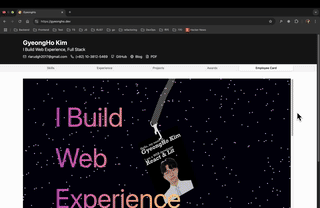

# GyeongHo Bookmark Telescope

You can install it from [Chrome Web Store](https://chromewebstore.google.com/detail/apapcobjnbpmndcpcedjhngmgocjancj?utm_source=item-share-cb)



A Chrome extension that provides nvim-telescope like interface for searching(live-grep) and previewing bookmarks. Press `Ctrl+Shift+P` (or `Cmd+Shift+P` on Mac) to open the telescope overlay.

## Features

- **Quick Access**: Press `Ctrl+Shift+P` from any webpage to open the telescope
- **Live Search**: Search through bookmarks with regex support
- **Preview Pane**: Shows raw HTML content of selected bookmarks
- **Keyboard Navigation**: Navigate with arrow keys, open with Enter, close with Escape
- **nvim-telescope Styling**: Dark theme with familiar telescope-like interface

## TODO

- [ ] Meaningful Summary in the preview pane(Raw HTML now)
- [ ] Add a shortcut to add a new bookmark
- [ ] Edit existing bookmark

## Installation

1. Open Chrome and navigate to `chrome://extensions/`
2. Enable "Developer mode" in the top right
3. Click "Load unpacked" and select this directory
4. The extension will be installed and ready to use

## Usage

1. **Open Telescope**: Press `Ctrl+Shift+P` (Windows/Linux) or `Cmd+Shift+P` (Mac) on any webpage
2. **Search**: Type in the search box to filter bookmarks by title or URL
3. **Navigate**: Use ↑↓ arrow keys to navigate through results
4. **Preview**: Selected bookmark's page content will be shown in the preview pane
5. **Open**: Press Enter or double-click to open the selected bookmark in a new tab
6. **Close**: Press Escape or click outside the overlay to close

## Keyboard Shortcuts

- `Ctrl+Shift+P` / `Cmd+Shift+P`: Open/close telescope
- `↑` / `↓`: Navigate through results
- `Enter`: Open selected bookmark
- `Esc`: Close telescope

## Search Features

- **Text Search**: Simple text matching in bookmark titles and URLs
- **Regex Search**: Use regular expressions for advanced filtering
- **Case Insensitive**: All searches are case insensitive

## Technical Details

This extension uses:
- **Manifest V3** with service worker
- **Commands API** for keyboard shortcuts
- **Bookmarks API** for accessing browser bookmarks
- **Content Scripts** for overlay injection
- **Cross-origin requests** for page preview fetching

## Files Structure

- `manifest.json`: Extension configuration
- `service-worker.js`: Background script handling commands and bookmark fetching
- `content-script.js`: Main telescope interface logic
- `telescope.css`: Telescope overlay styling
- `images/`: Extension icons

## Privacy

This extension:
- Only accesses your bookmarks when the telescope is opened
- Fetches page content for previews (raw HTML only)
- Does not store or transmit any personal data
- Runs entirely locally in your browser

# Debugging Guide for Bookmark Telescope

## Quick Debug Steps

### 1. Check Extension Installation
1. Open `chrome://extensions/`
2. Ensure "Developer mode" is enabled (top right)
3. Look for "Bookmark Telescope" extension
4. Check if it's enabled (toggle should be ON)
5. Note any error messages in red

### 2. Check Console Errors
1. Right-click on any webpage → "Inspect" → "Console" tab
2. Press Ctrl+L and check for errors
3. Common errors:
   - `Uncaught TypeError` - JavaScript error
   - `Content Security Policy` - Script blocked
   - `chrome.runtime.sendMessage` errors

### 3. Check Service Worker
1. Go to `chrome://extensions/`
2. Find "Bookmark Telescope" → Click "service worker"
3. This opens service worker console
4. Press Ctrl+L and check for errors
5. Should see: "Command received: open-telescope" (if we add logging)

### 4. Check Permissions
- Extension needs "bookmarks", "tabs", "activeTab" permissions
- Check if browser is blocking permissions

## Add Debug Logging

Add these console.log statements to see what's happening:

### In service-worker.js:
```javascript
chrome.commands.onCommand.addListener(async (command) => {
  console.log('Command received:', command);
  if (command === 'open-telescope') {
    const [tab] = await chrome.tabs.query({
      active: true,
      currentWindow: true
    });
    console.log('Active tab:', tab);
    chrome.tabs.sendMessage(tab.id, { action: 'toggle-telescope' });
    console.log('Message sent to content script');
  }
});
```

### In content-script.js:
```javascript
chrome.runtime.onMessage.addListener((message) => {
  console.log('Content script received message:', message);
  if (message.action === 'toggle-telescope') {
    console.log('Toggling telescope');
    this.toggle();
  }
});
```

## Common Issues

1. **Extension not loaded properly** - Reload extension
2. **Content script not injected** - Refresh the webpage
3. **Keyboard shortcut conflict** - Another extension using Ctrl+L
4. **CSP blocking scripts** - Some sites block content scripts
5. **Manifest errors** - Check extension details for errors